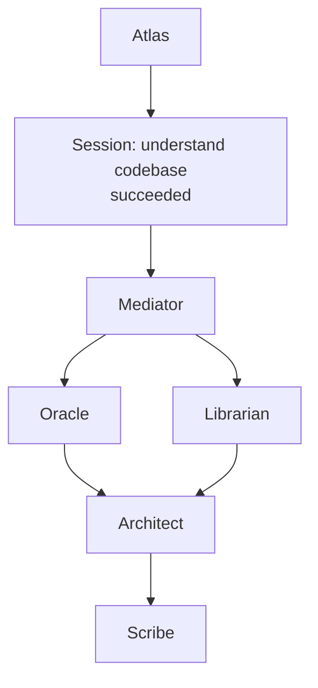
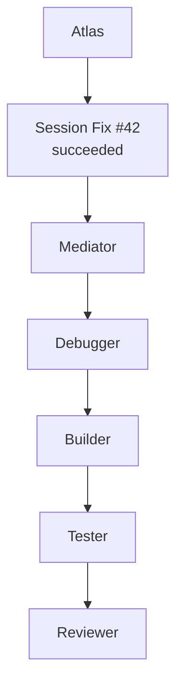
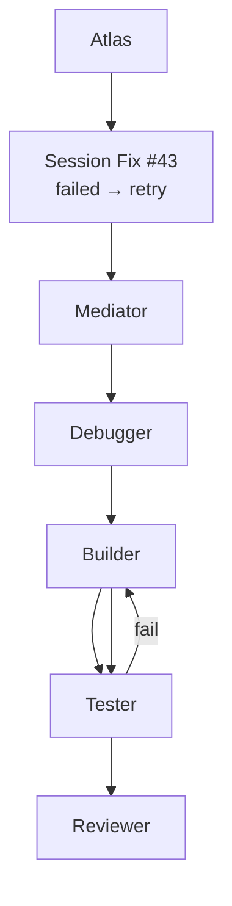
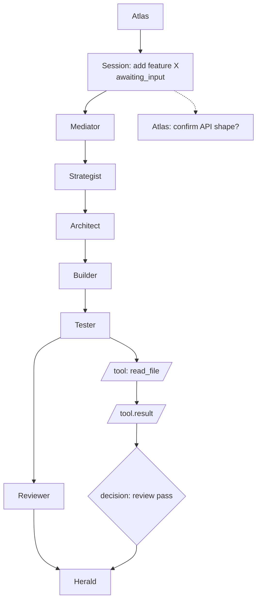
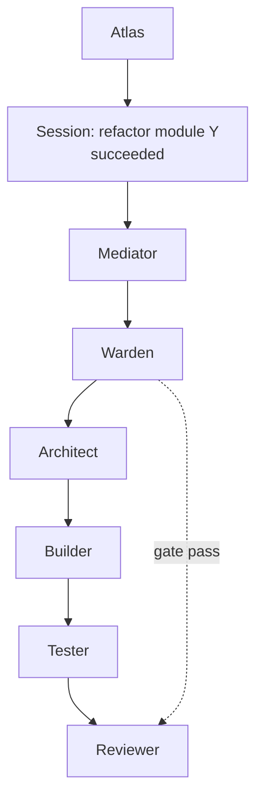
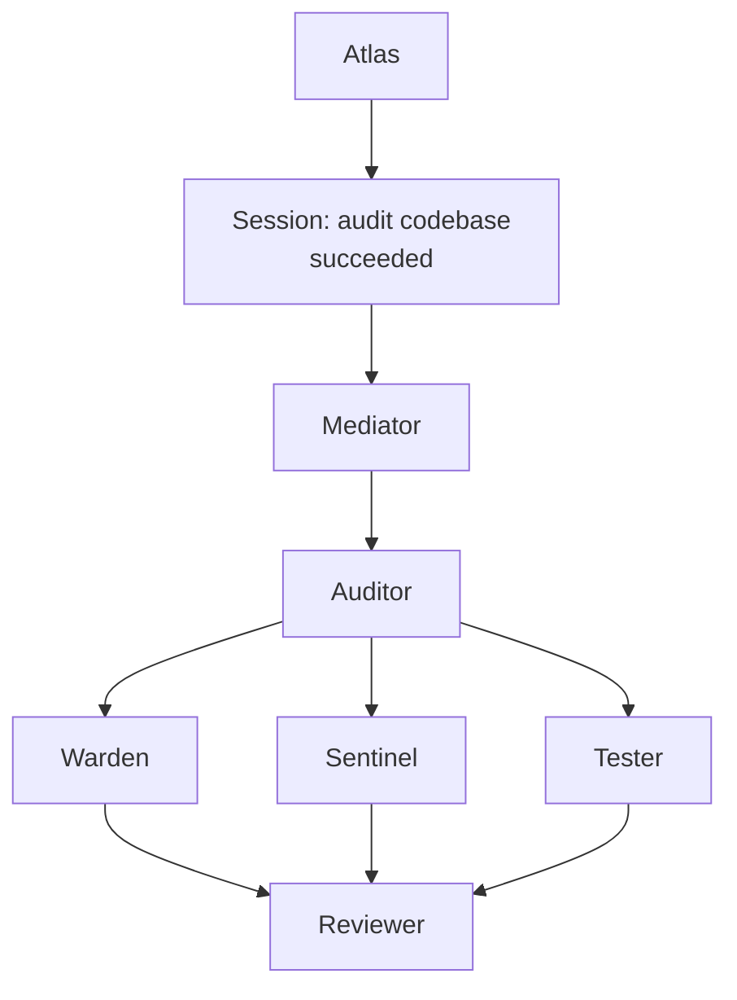
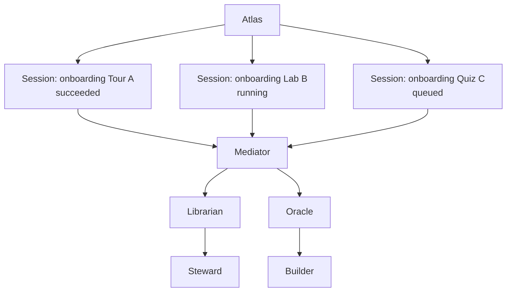
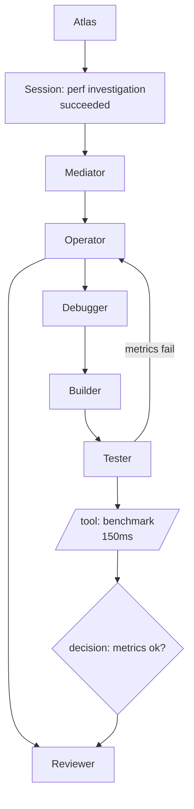

# FULL DAG Case Studies — Live Society Diagram

> Contract: `docs/adr/ADR-002` (members=nodes, handoffs=edges, color=gate, click→traces) and `ADR-003` (Atlas root). Rendered live by `dashboard/src/lib/graph.ts:49` `buildSocietyGraph({mode:"full"})` via dagre `TB` → React Flow.

## Legend

```mermaid
flowchart TD
  Atlas["Atlas<br/>root · bearer of sessions"]
  Atlas --> Session["Session<br/>queued / running / awaiting_input / succeeded / failed / cancelled"]
  Session --> M1["Member<br/>active pulse if running last"]
  M1 --> R1{{"reasoning<br/>hex — step coalesced"}}
  R1 --> T1[/"tool.called<br/>hex/parallelogram — name + args"/]
  T1 --> T1r[/"tool.result<br/>output"/]
  T1r --> D1{"decision<br/>diamond — outcome"}
  D1 --> Await["awaiting_input<br/>stadium dashed — Atlas asks"]
  Await --> Term(["terminal<br/>octagon ✔/✖"])
  classDef atlas fill:#0a0e1a,stroke:#7aa2ff
  classDef session fill:#0f1526,stroke:#ffffff1a
  classDef ok fill:#166534,stroke:#3ddc97
  classDef fail fill:#7f1d1d,stroke:#ff6b6b
  classDef running fill:#1e3a5f,stroke:#7aa2ff
```

- `StatusBadge` colors: `succeeded=ok`, `failed=danger`, `running=accent`, `awaiting_input=accent dashed`.
- Reasoning coalesced by `step` in `dashboard/src/lib/runProjection.ts:1`, tool pairing via `pairId` `dashboard/src/lib/eventPairing.ts:1`.
- Deep-link: `https://atlas.flabs.tech/project/<projectId>/session/<sessionId>?mode=full` or `?q=<base64url({p,s,n,m})>` via `dashboard/src/lib/shareLink.ts:1`.

---

## 1. Understand codebase (read-only fan-out)

Prompt: `Help me to understand the codebase on https://github.com/...` — mediator routes to `the-oracle`/`the-librarian` parallel reads, `the-architect` synthesizes, `the-scribe` records. No `Builder` mutation.

## 2. Fix bug (happy + retry loop)

Live recolor via `session.succeeded/failed` `dashboard/src/lib/sessionProjection.ts:13`.

## 3. Add feature (Spec→Build→Test→Review)

Shows `session.awaiting_input` dashed stadium + docked reply input `dashboard/src/app/page.tsx:1` → `POST /tasks/:id/reply`.

## 4. Refactor (Warden gate)

`the-warden` gate color; full DAG shows `decision` diamond `gate pass/fail`.

## 5. Audit (parallel fan-out)

`Auditor` fans to 3 checks, dagre `nodesep 48` fans out.

## 6. Onboarding (Atlas sky — multi-session)

Illustrates `ADR-003` — `buildSocietyGraph` handles `sessions.length>1`, `StatusBadge` mixed colors.

## 7. Performance (loop back to Operator)

Long-tail SSE, `bridge.gap` banner handling `dashboard/src/hooks/useEvents.ts:29`.

---

## Links
- Task breakdown: `docs/tasks/m4-live-dashboard.md:17`
- Architecture: `docs/architecture/README.md:148`
- Spec: `docs/spec/m3-task-api.md:51` `interaction/nextStep`
- ADR-002/003: `docs/adr/ADR-002*` `ADR-003*`
- Evidence sequences: `docs/sequence-diagrams-evidence.md:11` (time view complements this structural view)
