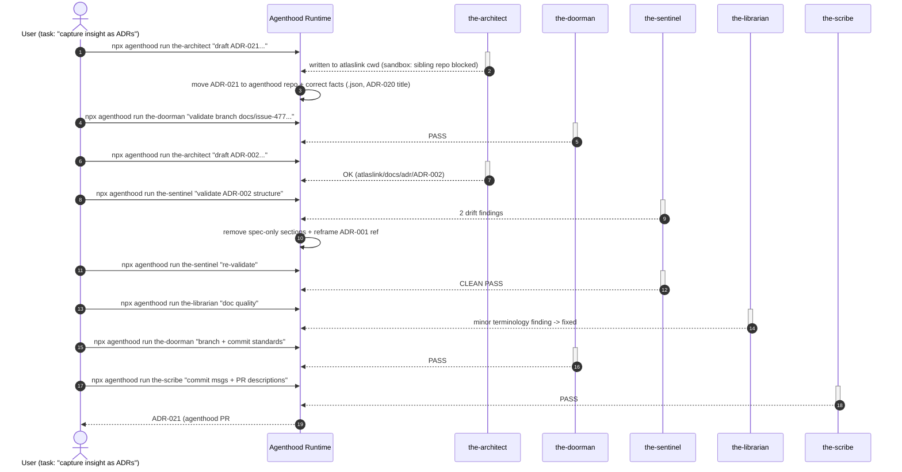
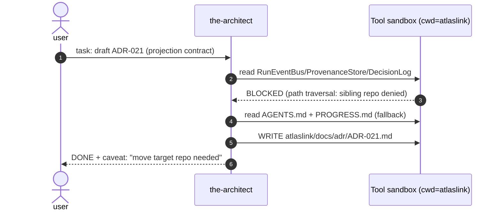
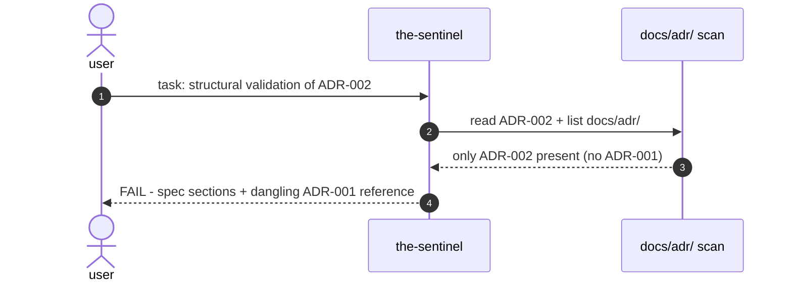
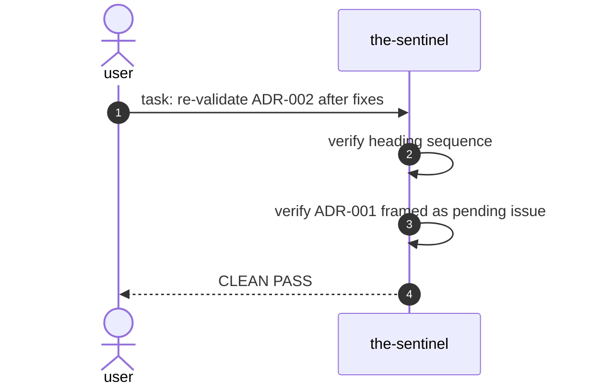
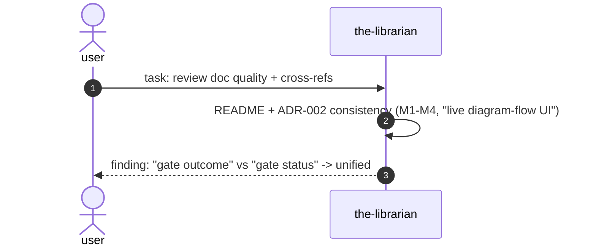
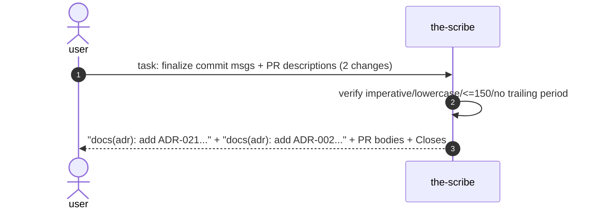

# Agenthood Sequence Diagrams — Live Execution Evidence

> **Purpose:** Record the delegation *occurrences* from the "capture the insight as ADRs" session, as evidence of the Agenthood runtime actually executing the multi-member delegation chain. These diagrams are the concrete visual contract that Atlaslink's M4 Live Dashboard (ADR-002) must render in real time from `RunEventBus` events and `.agenthood/provenance/*.json`.

The task-level view below is exactly the orchestration graph Atlaslink shows for a user "task"; the per-run views are the drill-down when a node is clicked.

## 1. Top-level "task" diagram — user prompt → sequence of member runs → outcome

Runs recorded from `2026-08-21T05:03`–`05:17` (see `.agenthood/provenance/`).

`RunEventBus` emits each step live (`run.started`, `tool.called`, `decision.recorded`, `run.finished/failed`) — the stream the M2 Event Bridge relays to the M4 dashboard.

## 2. Per-run diagrams (drill-down views)

### a. the-architect — draft ADR-021

### b. the-sentinel — validate ADR-002 (first pass)

### c. the-sentinel — re-validate (clean pass)

### d. the-librarian — doc quality

### e. the-scribe — commit messages + PR descriptions

## Design

- **Task-level view** (section 1) = the orchestration graph Atlaslink shows for a user prompt.
- **Per-run view** (section 2) = drill-down when a member node is selected.
- Both are rebuilt in real time from `.agenthood/provenance/*.json` + `RunEventBus` events, per Agenthood ADR-021 (projection contract) and Atlaslink ADR-002 (live diagram of society provenance).
